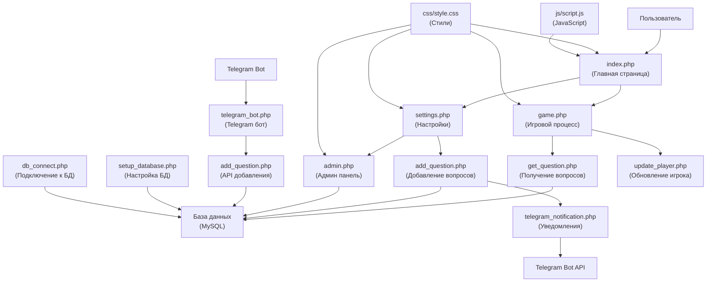
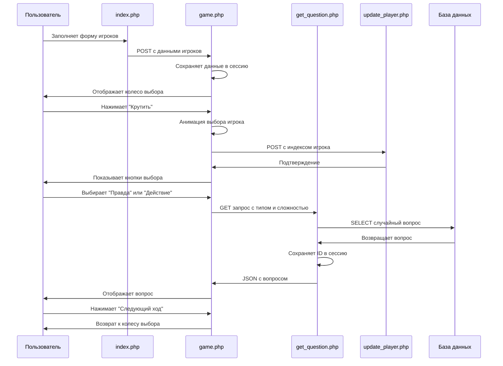
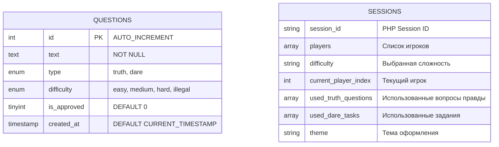

# Правда или Действие - Документация проекта

## 📋 Описание проекта

"Правда или Действие" - это веб-приложение для популярной игры, написанное на PHP с использованием MySQL базы данных. Проект включает веб-интерфейс для игры, административную панель, Telegram бота и систему управления вопросами.

## 🌳 Структура проекта

```
pd/
├── index.php                 # Главная страница
├── game.php                  # Игровая логика
├── settings.php              # Настройки и предложения вопросов
├── admin.php                 # Административная панель
├── db_connect.php            # Подключение к базе данных
├── setup_database.php        # Настройка базы данных
├── get_question.php          # API получения вопросов
├── add_question.php          # API добавления вопросов
├── update_player.php         # API обновления текущего игрока
├── telegram_bot.php          # Telegram бот
├── telegram_notification.php # Уведомления в Telegram
├── css/
│   └── style.css            # Основные стили
└── js/
    └── script.js            # JavaScript логика
```

## 📝 Описание файлов

### 🏠 index.php
**Назначение:** Главная страница приложения и точка входа для пользователей.

**Ключевые функции:**
- Форма для ввода имен игроков (минимум 2)
- Выбор уровня сложности (простой, средний, сложный, незаконный)
- Динамическое добавление/удаление игроков
- Система тем оформления (светлая/темная)

**Связи с другими файлами:**
- Отправляет данные в `game.php`
- Использует стили из `css/style.css`
- Подключает `js/script.js` для интерактивности

**Логика:** Собирает информацию о игроках и настройках игры, проверяет минимальное количество игроков (2), сохраняет выбранную тему в сессии.

### 🎮 game.php
**Назначение:** Основная игровая логика и интерфейс игрового процесса.

**Ключевые функции:**
- Анимированное колесо выбора игрока
- Кнопки выбора "Правда" или "Действие"
- Отображение вопросов и заданий
- Управление ходами игры

**Связи с другими файлами:**
- Получает данные от `index.php`
- Запрашивает вопросы через `get_question.php`
- Обновляет текущего игрока через `update_player.php`
- Использует `db_connect.php` для работы с БД

**Логика:** 
1. Принимает данные игроков и сохраняет в сессию
2. Показывает анимированное колесо для выбора игрока
3. Предлагает выбор между "Правда" и "Действие"
4. Отображает полученный вопрос/задание
5. Переходит к следующему ходу

### ⚙️ settings.php
**Назначение:** Страница настроек с возможностью предложения новых вопросов.

**Ключевые функции:**
- Переключение темы оформления
- Форма для предложения новых вопросов
- Отправка уведомлений в Telegram

**Связи с другими файлами:**
- Использует `db_connect.php` для сохранения вопросов
- Подключает `telegram_notification.php` для уведомлений

**Логика:** Позволяет пользователям менять тему интерфейса и предлагать собственные вопросы для модерации.

### 👨‍💼 admin.php
**Назначение:** Административная панель для управления контентом.

**Ключевые функции:**
- Авторизация администратора (пароль: admin123)
- Статистика вопросов по типам и сложности
- Модерация предложенных вопросов
- Добавление новых вопросов напрямую

**Связи с другими файлами:**
- Использует `db_connect.php` для работы с БД

**Логика:** Предоставляет инструменты для модерации контента, просмотра статистики и управления базой вопросов.

### 🗄️ db_connect.php
**Назначение:** Центральный файл подключения к базе данных.

**Ключевые функции:**
- Установка соединения с MySQL
- Автоматическое создание таблицы questions
- Настройка кодировки UTF-8

**Связи с другими файлами:**
- Используется во всех PHP файлах для работы с БД

**Логика:** Создает подключение к базе данных и обеспечивает консистентность структуры.

### 🔧 setup_database.php
**Назначение:** Инициализация базы данных и заполнение начальными данными.

**Ключевые функции:**
- Создание базы данных и таблиц
- Заполнение начальными вопросами (75 штук)
- Проверка существования данных

**Связи с другими файлами:**
- Независимый файл для первоначальной настройки

**Логика:** Выполняется однократно при развертывании проекта для создания структуры БД.

### 📊 get_question.php
**Назначение:** API для получения случайных вопросов.

**Ключевые функции:**
- Фильтрация по типу (truth/dare) и сложности
- Исключение уже использованных вопросов
- Резервные вопросы при отсутствии в БД
- Сброс списка использованных при исчерпании

**Связи с другими файлами:**
- Вызывается из `game.php` через AJAX
- Использует `db_connect.php`

**Логика:** Обеспечивает уникальность вопросов в рамках одной игровой сессии.

### ➕ add_question.php
**Назначение:** API для добавления новых вопросов.

**Ключевые функции:**
- Валидация данных вопроса
- Поддержка API ключа для автоматического одобрения
- Отправка уведомлений в Telegram
- JSON ответы для внешних интеграций

**Связи с другими файлов:**
- Используется в `settings.php` и `telegram_bot.php`
- Подключает `telegram_notification.php`

**Логика:** Универсальный API для добавления вопросов как через веб-интерфейс, так и через Telegram бота.

### 🔄 update_player.php
**Назначение:** API для обновления текущего игрока в сессии.

**Ключевые функции:**
- Валидация индекса игрока
- Обновление сессии
- JSON ответы

**Связи с другими файлами:**
- Вызывается из `game.php` через AJAX

**Логика:** Простой API для синхронизации состояния игры между клиентом и сервером.

### 🤖 telegram_bot.php
**Назначение:** Telegram бот для администраторов.

**Ключевые функции:**
- Авторизация администраторов по ID
- Добавление вопросов через интерактивное меню
- Просмотр статистики
- Система состояний для диалогов

**Связи с другими файлами:**
- Использует `add_question.php` как API
- Подключает `db_connect.php`

**Логика:** Предоставляет альтернативный интерфейс для администрирования через Telegram.

### 📢 telegram_notification.php
**Назначение:** Отправка уведомлений в Telegram.

**Ключевые функции:**
- Функция `sendTelegramNotification()`
- Обработка ошибок cURL
- Логирование неудачных отправок

**Связи с другими файлами:**
- Используется в `settings.php` и `add_question.php`

**Логика:** Централизованная система уведомлений для информирования администраторов о новых предложениях.

### 🎨 css/style.css
**Назначение:** Основные стили и дизайн приложения.

**Ключевые функции:**
- CSS переменные для тем
- Адаптивный дизайн
- Анимации для игровых элементов
- Стили для всех компонентов

**Связи с другими файлами:**
- Подключается во всех HTML страницах

**Логика:** Обеспечивает единообразный дизайн и поддержку светлой/темной темы.

### ⚡ js/script.js
**Назначение:** Клиентская JavaScript логика.

**Ключевые функции:**
- Динамическое добавление/удаление игроков
- Валидация формы
- Переключение темы в реальном времени

**Связи с другими файлами:**
- Подключается в `index.php`

**Логика:** Улучшает пользовательский опыт через интерактивные элементы.

## 🏗️ Архитектура проекта

### Общая структура

Проект построен по классической архитектуре веб-приложения:



### Поток данных в игровом процессе



### Структура базы данных



## 📚 Библиотеки и фреймворки

### Внешние библиотеки

1. **Font Awesome 6.0.0**
   - **Назначение:** Иконки для интерфейса
   - **Использование:** Подключается через CDN во всех HTML страницах
   - **Применение:** Иконки кнопок, навигации, административной панели

2. **MySQL/MySQLi**
   - **Назначение:** Работа с базой данных
   - **Использование:** Встроенное расширение PHP для MySQL
   - **Применение:** Все операции с базой данных

3. **cURL**
   - **Назначение:** HTTP запросы к внешним API
   - **Использование:** Встроенная библиотека PHP
   - **Применение:** Telegram Bot API, внутренние API вызовы

### Внутренние технологии

1. **PHP Sessions**
   - **Назначение:** Хранение состояния игры
   - **Применение:** Игроки, использованные вопросы, настройки темы

2. **AJAX/Fetch API**
   - **Назначение:** Асинхронные запросы без перезагрузки страницы
   - **Применение:** Получение вопросов, обновление игрока

3. **CSS Custom Properties (переменные)**
   - **Назначение:** Система тем оформления
   - **Применение:** Переключение между светлой и темной темой

## 🚀 Точка входа и запуск

### Запуск проекта

1. **Первоначальная настройка:**
   ```bash
   # Разместить файлы на веб-сервере с поддержкой PHP и MySQL
   # Настроить параметры базы данных в db_connect.php
   ```

2. **Инициализация базы данных:**
   ```
   http://your-domain.com/setup_database.php
   ```

3. **Главная точка входа:**
   ```
   http://your-domain.com/index.php
   ```

### Что выполняется первым

1. **При первом запросе к index.php:**
   - Запускается PHP сессия
   - Определяется текущая тема оформления
   - Загружается HTML шаблон с формой

2. **При инициализации базы данных:**
   - Создается база данных и таблица questions
   - Добавляются 75 предустановленных вопросов
   - Настраивается кодировка UTF-8

3. **При входе в игру:**
   - Валидируются данные игроков
   - Инициализируются сессионные переменные
   - Подготавливается игровое состояние

## 🏛️ Архитектурные особенности

### Нестандартные решения

1. **Сессионное хранение игрового состояния**
   - **Решение:** Использование PHP сессий для хранения списка игроков и использованных вопросов
   - **Причина:** Простота реализации, отсутствие необходимости в регистрации пользователей
   - **Плюсы:** Быстрая разработка, низкие требования к серверу
   - **Минусы:** Невозможность восстановления игры после закрытия браузера

2. **Гибридная архитектура для Telegram бота**
   - **Решение:** Telegram бот использует основное веб-приложение как API
   - **Причина:** Переиспользование логики, единая база данных
   - **Реализация:** Бот вызывает `add_question.php` как внутренний API

3. **Система резервных вопросов**
   - **Решение:** Жестко закодированные вопросы в `get_question.php`
   - **Причина:** Гарантия работоспособности игры даже при пустой БД
   - **Применение:** Автоматическое переключение при исчерпании вопросов в БД

4. **Двухуровневая система тем**
   - **Решение:** CSS переменные + PHP сессии
   - **Причина:** Сохранение выбора темы между страницами без JavaScript
   - **Реализация:** Сервер рендерит CSS класс, переменные меняют цвета

### Причины выбора архитектуры

1. **Простота развертывания**
   - Минимальные требования: PHP + MySQL
   - Один файл для настройки БД
   - Нет внешних зависимостей

2. **Модульность**
   - Каждая функция выделена в отдельный файл
   - API endpoints для интеграций
   - Разделение логики и представления

3. **Масштабируемость контента**
   - Система модерации вопросов
   - Multiple источники добавления контента
   - Автоматические уведомления

4. **Пользовательский опыт**
   - Адаптивный дизайн
   - Анимации и интерактивность
   - Система тем оформления

## 📱 Дополнительные возможности

### Telegram интеграция

- **Бот:** Полнофункциональный администраторский интерфейс
- **Уведомления:** Автоматические сообщения о новых вопросах
- **API:** Программный доступ к добавлению контента

### Система модерации

- **Предложения пользователей:** Любой может предложить вопрос
- **Административное одобрение:** Ручная модерация перед публикацией
- **Статистика:** Подробная аналитика по типам и сложности

### Адаптивность

- **Мобильные устройства:** Полная поддержка всех экранов
- **Темы оформления:** Светлая и темная тема
- **Доступность:** Семантическая разметка и ARIA атрибуты

---

*Документация создана для проекта "Правда или Действие" - веб-приложения для популярной игры с административной панелью и Telegram интеграцией.*